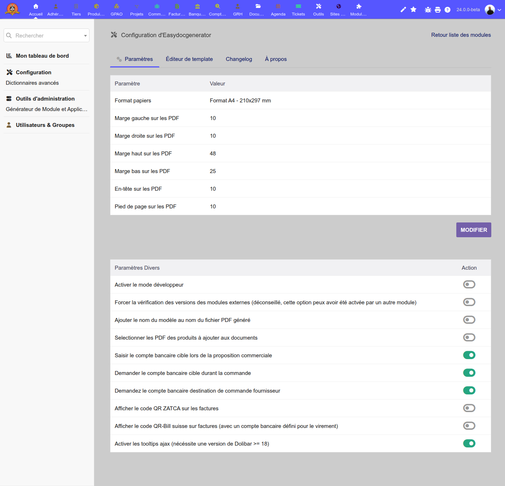
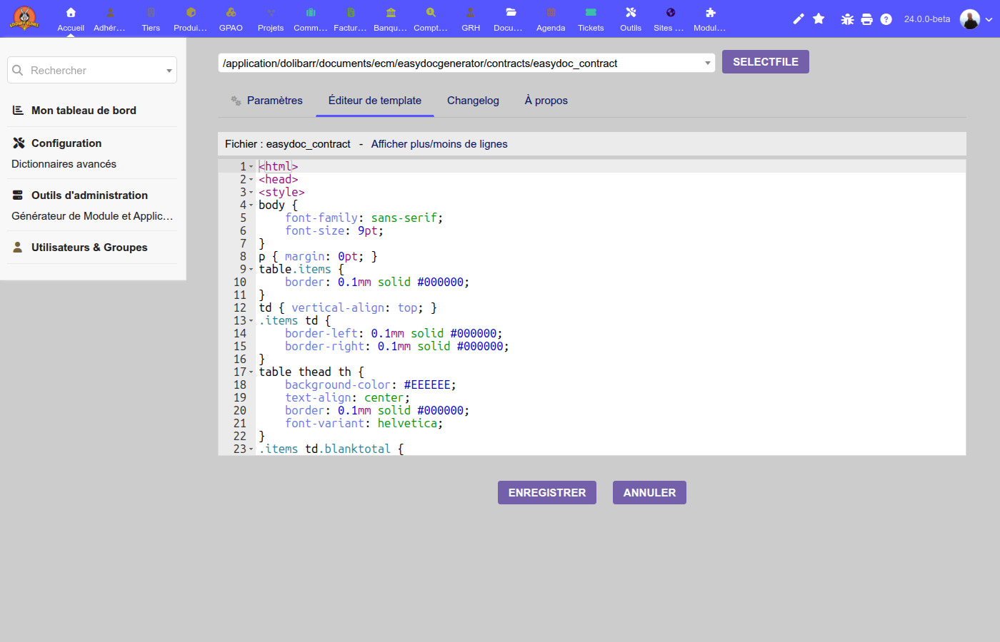
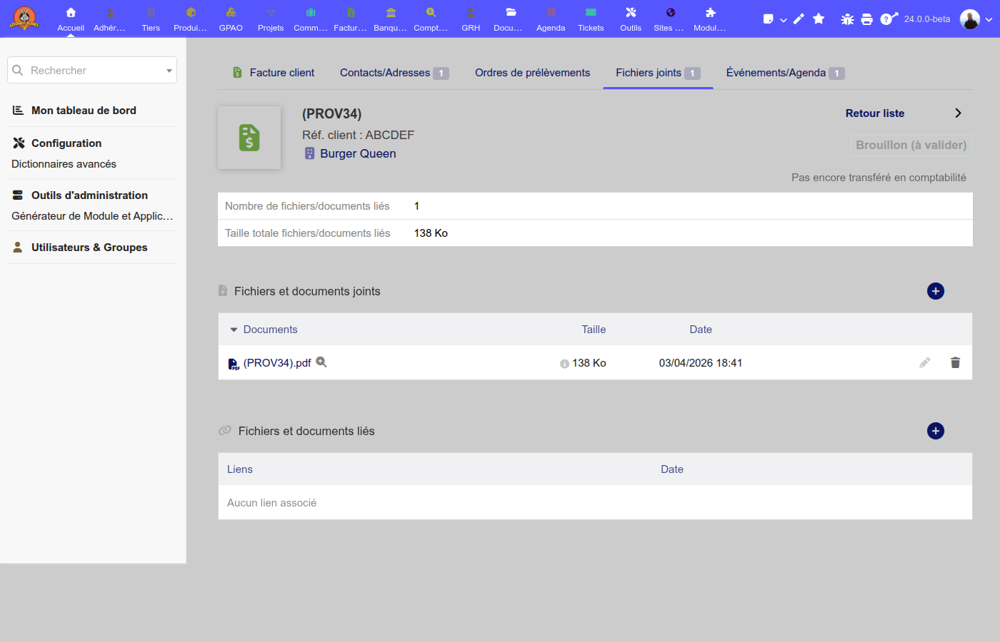

# EASYDOCGENERATOR FOR [DOLIBARR ERP CRM](https://www.dolibarr.org)

[](https://www.gnu.org/licenses/gpl-3.0)

**Easydocgenerator** is a Dolibarr module that lets you design fully custom PDF documents using [Twig](https://twig.symfony.com/) HTML templates rendered to PDF by [mPDF](https://mpdf.github.io/). Write plain HTML/CSS with Twig syntax, and the module injects all your Dolibarr business data — your company, customers, lines, contacts, photos — without any PHP code.

## Supported document types

| Type | Template section | Constant for template path |
|------|-----------------|---------------------------|
| Customer invoices | `invoices` | `INVOICE_ADDON_EASYDOC_TEMPLATES_PATH` |
| Customer orders | `orders` | `ORDER_ADDON_EASYDOC_TEMPLATES_PATH` |
| Commercial proposals | `propales` | `PROPALE_ADDON_EASYDOC_TEMPLATES_PATH` |
| Contracts | `contracts` | `CONTRACT_ADDON_EASYDOC_TEMPLATES_PATH` |
| Shipments / Expeditions | `shippings` | `SHIPPING_ADDON_EASYDOC_TEMPLATES_PATH` |
| Expense reports | `expensereports` | `EXPENSEREPORT_ADDON_EASYDOC_TEMPLATES_PATH` |
| Products | `products` | `PRODUCT_ADDON_EASYDOC_TEMPLATES_PATH` |
| Bills of materials (BOM) | `bom` | `BOM_ADDON_EASYDOC_TEMPLATES_PATH` |
| Warehouse inventory | `stocks` | `STOCK_ADDON_EASYDOC_TEMPLATES_PATH` |
| Support tickets | `tickets` | `TICKET_ADDON_EASYDOC_TEMPLATES_PATH` |

## Screenshots

### Module settings



### Template editor



### Generated document (invoice)



## Installation

Prerequisites: Dolibarr ≥ 17. Requires PHP 8.1+.

### From a ZIP file (recommended)

1. Download the latest `module_easydocgenerator-x.x.x.zip` from [Dolistore](https://www.dolistore.com) or the GitHub releases page.
2. In Dolibarr, go to **Home → Setup → Modules → Deploy external module** and upload the zip.
3. Go to **Home → Setup → Modules**, find *Easydocgenerator* and click **Enable**.

### From Git (development)

```bash
cd <dolibarr_root>/htdocs/custom
git clone https://github.com/frederic34/easydocgenerator.git easydocgenerator
cd easydocgenerator
composer install --no-dev
```

Then activate the module in Dolibarr as above.

## Configuration

Go to **Home → Setup → Modules → Easydocgenerator → Settings** (or navigate to `/custom/easydocgenerator/admin/setup.php`).

### PDF dimensions

| Parameter | Default | Description |
|-----------|---------|-------------|
| Paper format | A4 (210×297 mm) | Output paper size |
| Left margin | 10 mm | `EASYDOC_PDF_MARGIN_LEFT` |
| Right margin | 10 mm | `EASYDOC_PDF_MARGIN_RIGHT` |
| Top margin | 48 mm | `EASYDOC_PDF_MARGIN_TOP` — leave room for the HTML header |
| Bottom margin | 25 mm | `EASYDOC_PDF_MARGIN_BOTTOM` |
| Header margin | 10 mm | `EASYDOC_PDF_MARGIN_HEADER` |
| Footer margin | 10 mm | `EASYDOC_PDF_MARGIN_FOOTER` |

### Options

| Option | Description |
|--------|-------------|
| Developer mode | When enabled, Twig cache is disabled and a `{{ debug }}` variable with a full data dump is injected. Useful when authoring templates. |
| Add template name to PDF filename | The generated file is named `<ref>_<template>.pdf` instead of `<ref>.pdf` |
| Select product PDFs to add to documents | Merges product-attached PDFs into the generated document (proposals only) |
| ZATCA QR code | Adds a ZATCA-compliant QR code to invoices (Saudi Arabia) |
| Swiss QR-Bill | Adds a Swiss QR-Bill payment slip to invoices |
| Bank account on proposal / order | Asks for a target bank account when creating the document |

### Template directories

Each document type has its own template directory. The path is stored as a Dolibarr constant (see table above). Default paths are under:

```
<documents_root>/ecm/easydocgenerator/<type>/
```

Set the path in the module settings page for each document type, or upload `.twig` files directly from that page.

## Creating templates

Templates are standard HTML files with `.twig` extension. mPDF renders them to PDF — see the [mPDF HTML support reference](https://mpdf.github.io/reference/html-control-tags/overview.html) for what HTML/CSS is supported.

Example structure:

```twig
<html>
<head>
<style>
body { font-family: sans-serif; font-size: 9pt; }
</style>
</head>
<body>

<!--mpdf
<htmlpageheader name="myheader">
  <table width="100%"><tr>
    <td></td>
    <td>{{ mysoc.name }}<br/>{{ mysoc.address }}</td>
    <td style="text-align:right">{{ trans('Invoice') }} {{ object.ref }}</td>
  </tr></table>
</htmlpageheader>
<htmlpagefooter name="myfooter">
  <div style="text-align:center; font-size:7pt; border-top:0.5pt solid #000">
    {{ footerinfo.line3 }} — {PAGENO}/{nb}
  </div>
</htmlpagefooter>
<sethtmlpageheader name="myheader" value="on" show-this-page="1" />
<sethtmlpagefooter name="myfooter" value="on" />
mpdf-->

<p>{{ thirdparty.name }}, {{ thirdparty.address }}</p>


  <p>{{ line.linenumber }}. {{ line.desc }} — {{ price(line.total_ht) }}</p>


<p>Total HT: {{ price(object.total_ht) }}</p>

<p>{{ freetext }}</p>

</body>
</html>
```

### Template editor

The built-in editor (tab **Éditeur de template** in the admin settings) lets you browse and edit `.twig` files directly in the browser with syntax highlighting.

### Using example templates

The module ships with ready-to-use templates in the `templates/` folder:

- `easydoc_invoice.twig`
- `easydoc_order.twig`
- `easydoc_propale.twig`
- `easydoc_contract.twig`
- `easydoc_expensereport.twig`
- `easydoc_product.twig`
- `easydoc_bom.twig`
- `easydoc_stock.twig`
- `easydoc_ticket.twig`

Copy the one you need to the appropriate configured directory and customise it.

## Activating the model on a document type

After uploading a template, you must tell Dolibarr to use it as the PDF generator for that document type:

1. Go to **Home → Setup → PDF** (or the dedicated setup page for the module, e.g. *Factures → Setup*).
2. Under the document type's model list, select **Easydoc templates** and set it as the active (default) model.
3. On any document card, the **Generate PDF** action will now use your template.

## Twig variables reference

All variables are passed as a flat Twig context. Nested objects use dot notation: `{{ object.ref }}`, `{{ mysoc.name }}`, etc.

### Company (`mysoc`)

Available as `mysoc.*` — all public properties of `MySoc`:

| Variable | Description |
|----------|-------------|
| `mysoc.name` | Company name |
| `mysoc.address` | Street address |
| `mysoc.zip` | Postal code |
| `mysoc.town` | City |
| `mysoc.country` | Country name (translated) |
| `mysoc.country_code` | ISO country code (`FR`, `DE`, …) |
| `mysoc.phone` | Phone (raw) |
| `mysoc.phone_formatted` | Phone (formatted for the country) |
| `mysoc.phone_mobile_formatted` | Mobile (formatted) |
| `mysoc.fax_formatted` | Fax (formatted) |
| `mysoc.email` | Email |
| `mysoc.tva_intra` | Intra-community VAT number |
| `mysoc.siret` | SIRET number |
| `mysoc.siren` | SIREN number |
| `mysoc.logo` | Logo filename |
| `mysoc.flag` | Absolute path to the country flag PNG |

### Document (`object`)

Available as a flat merge into the root context (use without prefix: `object.ref`, `object.date`, etc.):

Common fields across all document types:

| Variable | Description |
|----------|-------------|
| `object.ref` | Document reference |
| `object.date` | Document date (Unix timestamp) |
| `object.total_ht` | Total amount excl. tax |
| `object.total_tva` | Total VAT |
| `object.total_ttc` | Total incl. tax |
| `object.note_public` | Public note |
| `object.note_private` | Private note |
| `object.multicurrency_code` | Currency code |
| `object.lines` | (not available in Twig — use `lines` instead) |

### Third-party / Customer (`thirdparty`)

| Variable | Description |
|----------|-------------|
| `thirdparty.name` | Company name |
| `thirdparty.address` | Address |
| `thirdparty.zip` | Postal code |
| `thirdparty.town` | City |
| `thirdparty.country` | Country name |
| `thirdparty.country_code` | ISO country code |
| `thirdparty.phone` | Phone (raw) |
| `thirdparty.phone_formatted` | Phone (formatted) |
| `thirdparty.fax_formatted` | Fax (formatted) |
| `thirdparty.email` | Email |
| `thirdparty.code_client` | Customer code |
| `thirdparty.tva_intra` | VAT number |
| `thirdparty.flag` | Absolute path to the country flag PNG |

### Document lines (`lines`)

Each element in `lines` is a document line. Common fields:

| Variable | Description |
|----------|-------------|
| `line.linenumber` | Display line number (skips special lines) |
| `line.desc` | Description |
| `line.qty` | Quantity |
| `line.subprice` | Unit price excl. tax |
| `line.total_ht` | Line total excl. tax |
| `line.total_ttc` | Line total incl. tax |
| `line.tva_tx` | Tax rate (%) |
| `line.remise_percent` | Discount (%) |
| `line.fk_product` | Product ID (0 if free text line) |
| `line.product_ref` | Product reference |
| `line.product_label` | Product label |
| `line.subtotal_ht` | Accumulated HT subtotal (reset at subtotal lines) |
| `line.special_code` | Special code (subtotal plugin: 104777) |
| `line.rang` | Sort order |

**With product data** (invoices, orders, contracts — `fetchProduct = true`):

| Variable | Description |
|----------|-------------|
| `line.product.*` | Full Product object properties |

**Extended lines** (proposals, shipments):

| Variable | Description |
|----------|-------------|
| `line.categories[]` | Array of product categories |
| `line.photos[]` | Array of paths to product photos |

### Contacts

Contacts are split by role type and scope (external / internal). Two patterns depending on document type:

**Pattern A** — keyed by contact ID (invoices, orders, proposals, shipments):

```twig

  {{ contact.firstname }} {{ contact.lastname }}

```

Available keys: `billing_external`, `billing_internal`, `shipping_external`, `shipping_internal`, `salesrepfoll_external`, `salesrepfoll_internal`, `customer_external`, `customer_internal`.

Each contact also has `contact.picture` if a photo is attached.

**Pattern B** — indexed array (contracts, stocks, tickets):

```twig

  {{ contact.firstname }} {{ contact.lastname }}

```

### Logo and utility variables

| Variable | Description |
|----------|-------------|
| `logo` | Absolute path to the company logo (respects `MAIN_PDF_USE_LARGE_LOGO`) |
| `freetext` | Configured free text (with Dolibarr substitution keys applied) |
| `footerinfo.line3` | Footer line 3 (legal info from Dolibarr config) |
| `footerinfo.line4` | Footer line 4 |
| `currency` | Currency code (`EUR`, `USD`, …) |
| `currencyinfo` | Translated currency label |
| `linkedObjects[]` | Linked documents (`ref_title`, `ref_value`) |
| `parameters.hidedetails` | Hide line details flag |
| `parameters.hidedesc` | Hide description flag |
| `parameters.hideref` | Hide reference flag |
| `debug` | Full HTML data dump — only present when developer mode is on |

### Product-specific variables

| Variable | Description |
|----------|-------------|
| `pictures[].dir` | Photo directory |
| `pictures[].thumb` | Thumbnail filename |
| `pictures[].original` | Original photo filename |
| `pictures[].exif` | EXIF data (if available) |

### Warehouse / Stock-specific variables

| Variable | Description |
|----------|-------------|
| `lines[].ref` | Product reference |
| `lines[].label` | Product label |
| `lines[].real_qty` | Current stock quantity |
| `lines[].pmp` | Average weighted price |
| `totalunit` | Total units across all products |
| `totalunique` | Number of distinct products |

### Invoice-specific variables

| Variable | Description |
|----------|-------------|
| `payments[]` | Payment history (date, amount, mode) |
| `discounts[]` | Available discounts/credits |
| `qrcode` | ZATCA QR code (base64 image) — when `INVOICE_ADD_ZATCA_QR_CODE` is on |
| `swissqrcode` | Swiss QR-Bill image path — when `INVOICE_ADD_SWISS_QR_CODE` is on |

## Twig functions

Six custom functions are available in all templates:

| Function | Description | Example |
|----------|-------------|---------|
| `trans(key, p1, p2, p3)` | Translate a key using the output language | `{{ trans('Invoice') }}` |
| `transbis(key, ...)` | Translate using the secondary language (`PDF_USE_ALSO_LANGUAGE_CODE`) | `{{ transbis('Total') }}` |
| `getDolGlobalString(key, default)` | Read a Dolibarr constant | `{{ getDolGlobalString('MAIN_INFO_SOCIETE_NOM') }}` |
| `date(timestamp, format)` | Format a Unix timestamp using Dolibarr's `dol_print_date()` | `{{ date(object.date, 'day') }}` |
| `price(amount)` | Format a number as a price (currency symbol, decimal separator) | `{{ price(object.total_ht) }}` |
| `numbertowords(amount, currency, lang)` | Convert an amount to words | `{{ numbertowords(object.total_ttc, 'EUR', 'fr') }}` |

### `date()` format strings

Standard Dolibarr formats: `'day'`, `'dayhour'`, `'dayhourlog'`, `'%d/%m/%Y'`, etc.

### mPDF page headers and footers

Wrap header/footer HTML in mPDF-specific comments:

```html
<!--mpdf
<htmlpageheader name="myheader">...</htmlpageheader>
<htmlpagefooter name="myfooter">...</htmlpagefooter>
<sethtmlpageheader name="myheader" value="on" show-this-page="1" />
<sethtmlpagefooter name="myfooter" value="on" />
mpdf-->
```

Use `{PAGENO}` and `{nb}` for page numbers.

## Multilingual support

The module supports generating PDFs in the document's configured language. Dolibarr's `PDF_USE_ALSO_LANGUAGE_CODE` constant enables bilingual output — use `transbis()` for the secondary language strings.

Bundled interface translations: **fr_FR**, **en_US**, **de_DE**, **es_ES**, **it_IT**, **pl_PL**, **pt_PT**.

## Developer mode

Enable **Developer mode** in the module settings to:

- Disable Twig template caching (changes to templates take effect immediately without clearing cache)
- Inject a `{{ debug }}` variable containing a full `<pre>` dump of all substitution variables passed to the template

```twig

  {{ debug }}

```

## Translations

Interface translations live in `langs/<locale>/easydocgenerator.lang`. New translations can be contributed by editing those files or via the `.tx/autotranslator.php` script (requires a Google Translate API key).

## Libraries

The module bundles the following PHP libraries (installed via Composer):

- **mPDF** — HTML to PDF rendering
- **Twig** — Template engine
- **NumberToWords** — Amount-to-words conversion

See the **About** tab in the module settings for the exact version of each bundled library.

## Licenses

### Main code

GPLv3 or (at your option) any later version. See file COPYING for more information.

### Documentation

All texts and readmes are licensed under GFDL.
